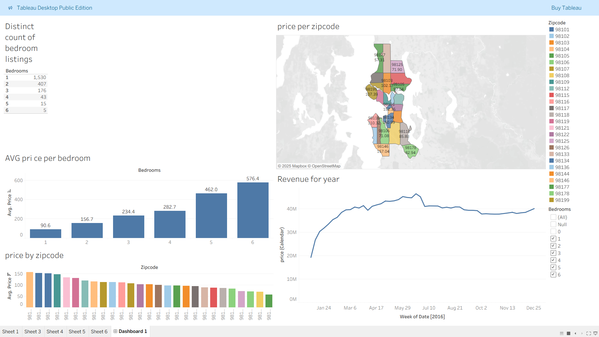

# Airbnb Tableau Dashboard

## 📊 Project Overview
This project contains a Tableau dashboard analyzing Airbnb listings, focusing on pricing, room types, zip code distribution, and revenue trends.

The goal is to understand how location, number of bedrooms, and time influence pricing and demand in the Airbnb marketplace.

## 🧠 Dataset
**Source:** Airbnb Listings — 2016  
Dataset link: https://kaggle.com/datasets/alexanderfreberg/airbnb-listings-2016-dataset

> ⚠️ Dataset is not included due to licensing.  
> Please download it from Kaggle and connect it in Tableau when opening the `.twb` file.

## 📂 Project Files

| File | Description |
|------|------------|
| `AIRBNB.twb` | Main Tableau workbook |

## 🚀 How to Use
1. Clone or download this repository
2. Download the dataset from Kaggle
3. Open the `AIRBNB.twb` file in Tableau Desktop or Tableau Public
4. Connect the workbook to the dataset when prompted

## 📸 Dashboard Preview

*(Image shows bedroom distribution, average price per bedroom, price by zipcode, and revenue trends over 2016)*

## 🔮 Future Improvements
- Add filters for price ranges & review scores
- Publish interactive version to Tableau Public
- Add geospatial heat map for demand intensity

